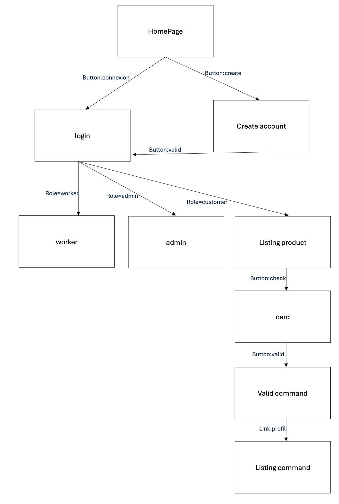

# Frontend of the project

## Description
This is the frontend of the project. It is a React application that uses the backend API to display the data. 
It is a simple application for command of fast food. The user can see the menu, add items to the cart and place an order.

## Technologies
- React : A JavaScript library for building user interfaces
- Axios : Promise based HTTP client for the browser and node.js
- React Router : Declarative routing for React
- React Bootstrap : Bootstrap components built with React
- React Query : Hooks for fetching, caching and updating asynchronous data in React
- Yup : A JavaScript schema builder for value parsing and validation
- React Hook Form : Performant, flexible and extensible forms with easy-to-use validation
- Tailwind CSS : A utility-first CSS framework for rapidly building custom designs

## Installation

1. install the dependencies
```bash
npm install
```

2. Run the application
```bash
npm start
```

## Environment Variables
- API_URL : The URL of the backend API

## Docker
1. launch the script
```bash 
./docker.sh
```

## Author

👤 **Randy Dev (dochot.be)**


## Schema




## Account in the application

- Customer: create an account with page of registration
- Admin: account is created by the backend in environment variables, and after in admin page, the admin can create a new admin account
- Worker: in admin page, the admin can create a new worker account


## Structure of the application

```text
src
├── components # Components of the application
│   
├── pages # Pages of the application
│
├── styles # Styles of the application
│
├── api.ts # File for the API (listing of the endpoints)
│
├── App.tsx # Main component of the application
│
├── structure.ts # File for the structure of objects (link between the backend and the frontend)
```